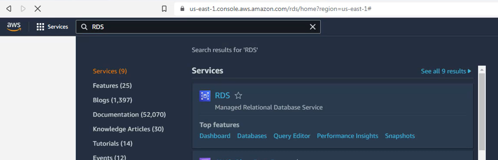
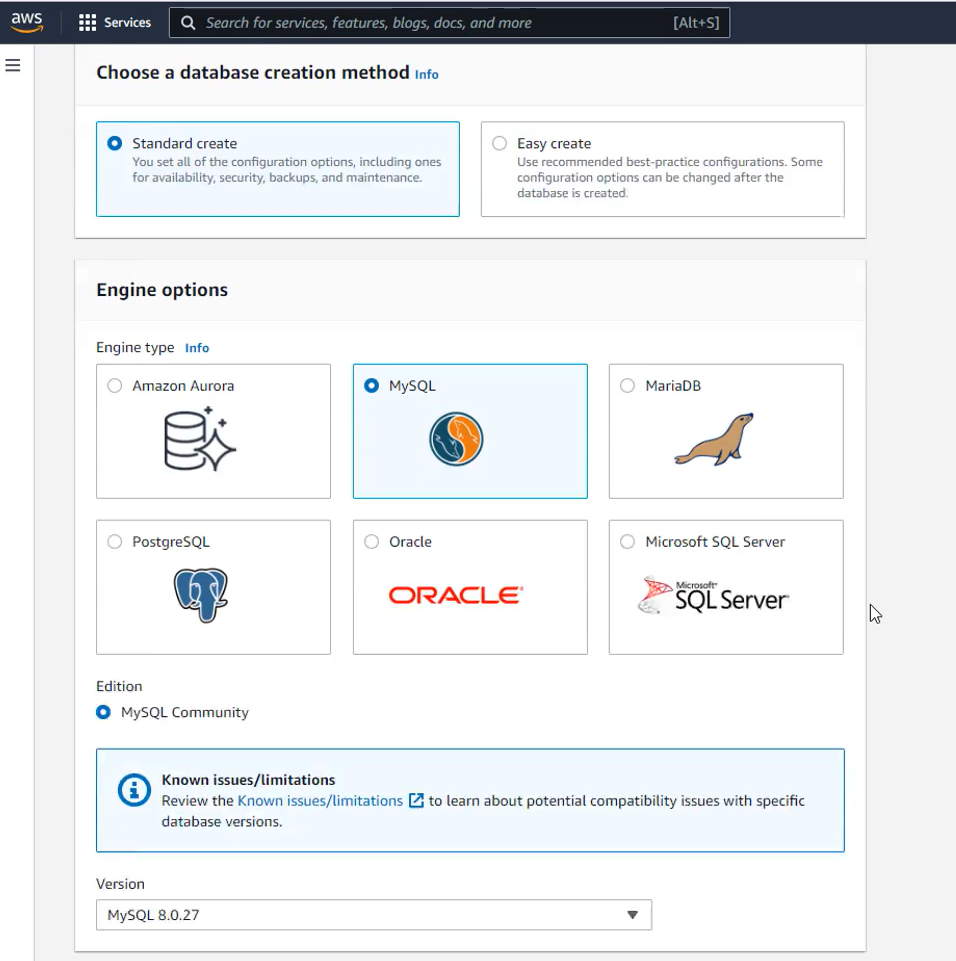
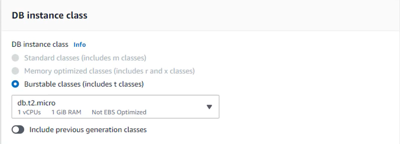
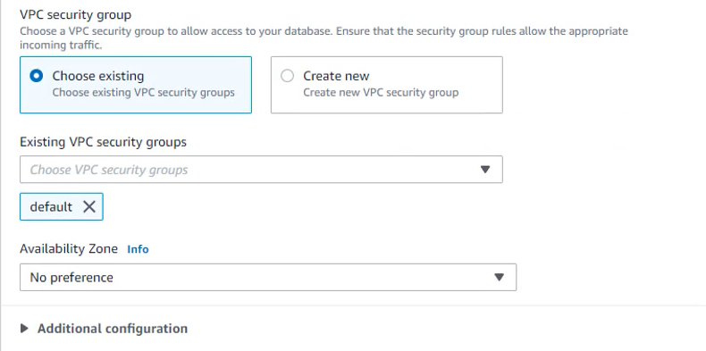
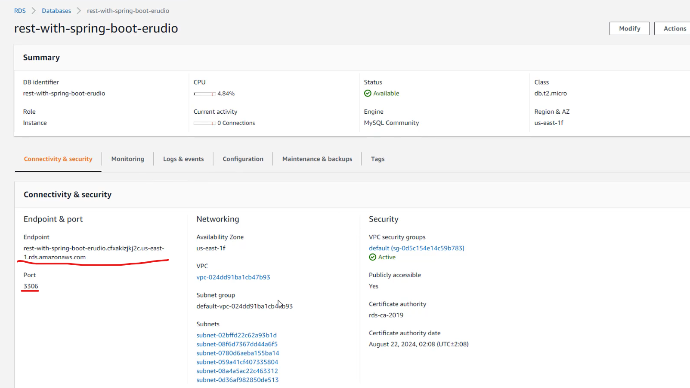
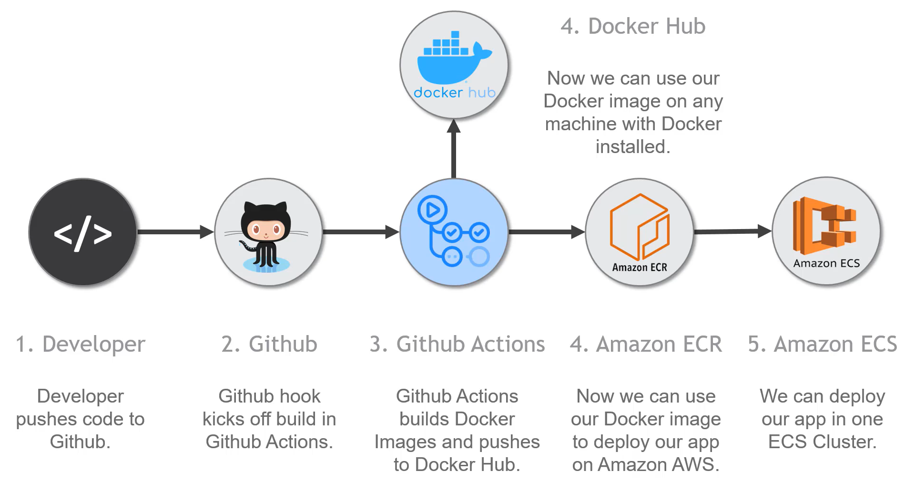
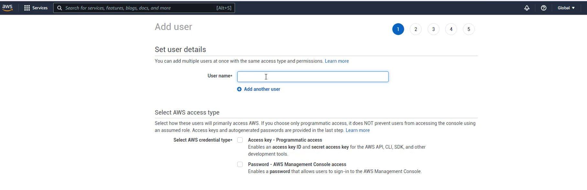
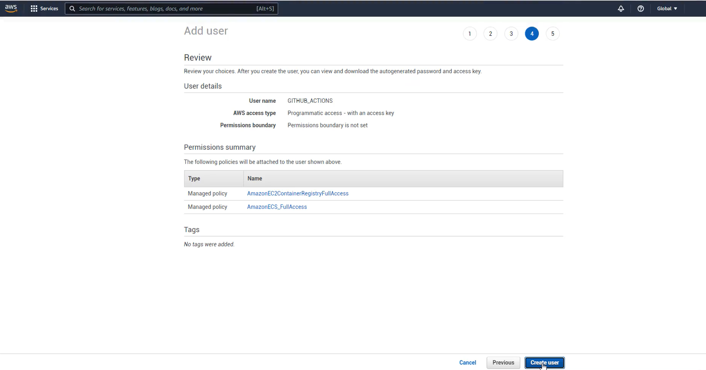
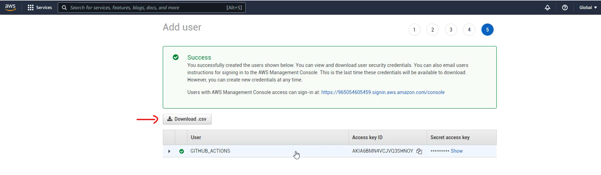

# Implantando nossa Aplicação na Amazon AWS

## Criação do Banco de Dados MySQL RDS na Amazon AWS

* No console AWS procurar o serviço RDS
 

* Na aba lataral em Dashboar apertar o botão "Create database". 

* Na proxima tela pode escolher a forma de criar o banco "Standart" ou "easy", pode manter a opção default.

* Depois escolha o banco de sua opção, no caso vamos criar **MySQL**

* Em **Templates** escolha o caso especifico, caso ainda tenha utilize o Free tier.

* Em **Availability and durability** manter *Single DB* nesse caso é só para teste.

* **Settings** preencha identificação para instancia, preferencia o mesmo nome utilizado na api.

* **Credentials Setting** prencha o *username* e *password*, depois confirme o *password*.

* Em **DB instance class** escolha a preferência da máquina.

* **Storage** Desabilite o *auto-scaling* e mantenha os padrões.

* **Connectivity** mantenha a rede default depois em Public acess marque de acordo com a sua necessidade nesse caso vamos escolher **Yes** para acesso público.

* VPC security group nesse caso escolha o default.

* **Database authentication** marque a opção Password authentition

*  **Additional configuration** defina o nome do banco de dado.

*  **Backup**, **Monitoring** e **Log exports** não precisa.

* em **IAM role** manter a sugestão.

* **Maintenance** 
  * *Enable auto minor version upgrade* desmarcar;
  * *Maintenance window* marcar *No preference*
  * *Deletion protection* só manter marcado caso for para produção.

* Finalize em *Create database*

### Databases

* é só clicar em DB identifier que vai abrir as configurações do banco.

* Com as informações do *Endipoint* e *Port* você pode fazer a conexão pela sua máquina local.

# Criação de um Usuário IAM Para Gerenciar os Serviços Amazon ECR e ECS

* No console AWS pesquise por IAM, isso vai garantir permissão de acesso aos nossos recursos sem passar usuario e senha que tem permissão total.

* Na aba lateral acesse Users, depois click em **Add users**.

* Na proxima tela preencha um nome para o usuario.

* *Select AWS access type* em ***Select AWS credential type*** marque a opção **Access key - Programatic access**. Click **Next: Permissions.**

* Na proxima tela adicionaremos as permissões desse usuarios.
As permissões que esse usurio pode ter: 
  * Adicionar a um Grupo nesse caso pode até criar um primeiro.
  * Pode copiar as permissões de usuario existente.
  * Pode atachar politicas existente ao usuario diretamente.

* Click **Attach existing polices directly** e adicionar as permissões para os serviços ECR, em **Filter polices** perquise por
*AmazonEC2*, procure a police ***AmazonEC2ContainerRegystrerFullAccess*** que da acesso total Amazon EC2 container regytry ou ECR selecione essa opção.
Depois perquise *AmazonECS* e selecione a police ***AmazonECS_FullAccess***. Click em **Next: Tags**.

* Na proxima etapa **Tag** caso precise adicione uma tag caso contrario click **Next: Review**.

* Click em **Create user**, na proxima tela é confimração de criação com sucesso de usuario, essa tela é muito **importante** 
pois as informações de **Acess key ID** e **Secret access key** após fechada essa pagina não poder ser mais recuperadas, então faça o download do arquivo **CSV** e quarde em pasta especifica em sua máquina.

