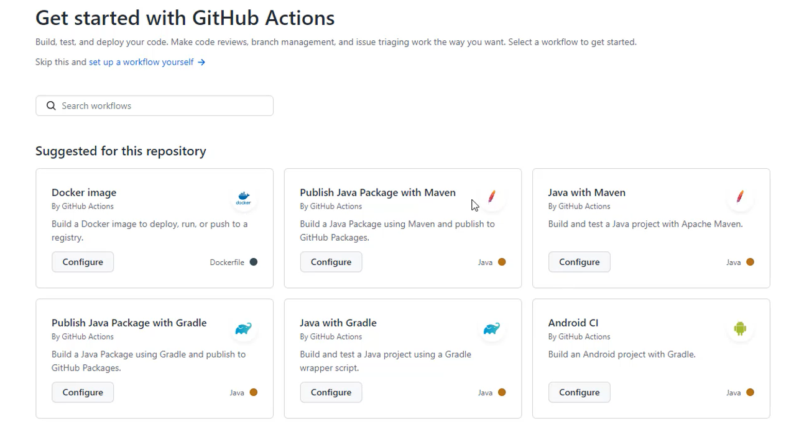

# Integração Contínua com o Github Actions


## Criar variaveis de ambiente no GitHub Actions

```text
.
|--- Settings
|    |--- Secrete
|    |    |--- Enviroment secrets
|    |    |--- New repository secret (Botão)
```


* DOCKER_USERNAME
  * Usuário no Dockerhub
* DOCKER_PASSWORD
    * Senha no Dockerhub

## Scrip Actions

* Na aba action em seguida aparece sugestões de repositorios


* Para primeira opção escolhemos ***Java with Maven*** em seguida adeguar para configurações do projeto.

```yaml
name: Continuous Integration with Github Actions

on:
  push:
    branches:
      - master
jobs:
  build:
    runs-on: ubuntu-latest

    steps:
    - uses: actions/checkout@v3

    - name: Login to Docker Hub
      uses: docker/login-action@v2.0.0
      with:
        username: ${{ secrets.DOCKER_USERNAME }}
        password: ${{ secrets.DOCKER_PASSWORD }}
    
    - name: Set up JDK 17
      uses: actions/setup-java@v3
      with:
        java-version: '17'
        distribution: 'adopt'
        cache: maven

    - name: Build Application JAR
      working-directory: ./RestWithSpringBootJNS
      run: mvn clean package

    - name: Docker Compose Build
      working-directory: ./rest-with-spring-boot-and-java-jns
      run: docker compose build

    - name: Push to Docker Hub Container Registry
      run: |
        docker tag ${{ secrets.DOCKER_USERNAME }}/rest-with-spring-boot-jns:latest ${{ secrets.DOCKER_USERNAME }}/rest-with-spring-boot-jns:${{ github.run_id }}

        docker push ${{ secrets.DOCKER_USERNAME }}/rest-with-spring-boot-jns:${{ github.run_id }}
        docker push ${{ secrets.DOCKER_USERNAME }}/rest-with-spring-boot-jns:latest
```
